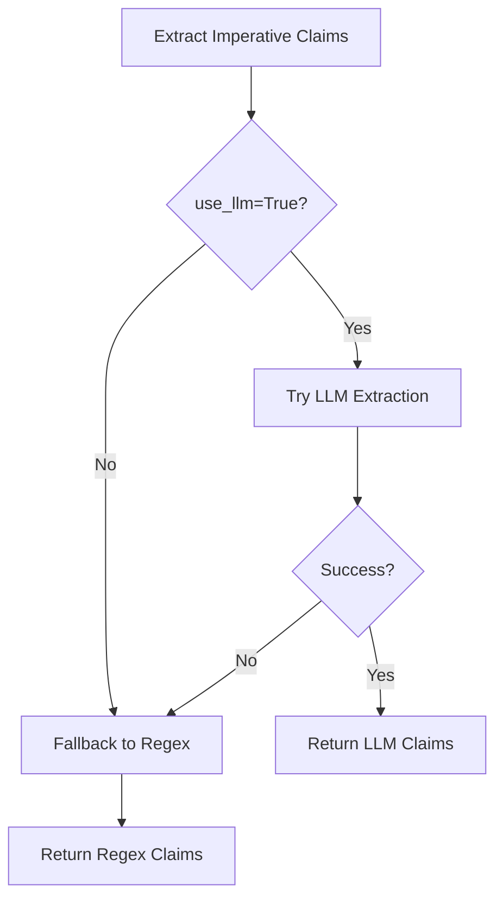

# LLM-Driven Claim Extraction for Bijective Dimension

## Overview

The bijective dimension now uses **LLM-driven claim extraction** to robustly extract imperative claims from natural language requirements, with intelligent fallback to regex patterns.

## Why LLM-Driven?

### Problem with Pure Regex
The original regex pattern failed on multi-word phrases:
```python
# Old pattern: Only matches single words
pattern = r'(support|supports)\s+(\w+)\s+(?:in|for)\s+(\w+)'

# FAILS on: "support header rows in RestructuredText"
# Because "header rows" has a space (not captured by \w+)
```

### Solution: LLM + Enhanced Regex Fallback

**Dual approach**:
1. **Primary**: LLM extraction with Logic Vernacular Ontology prompt
2. **Fallback**: Enhanced regex that handles multi-word phrases

## Implementation

### File Modified
- `python/quality_gate/dimension_bijective.py`

### New Method: `_extract_imperative_claims_llm()`

```python
def _extract_imperative_claims_llm(self, requirements: str) -> List[LogicTuple]:
    """
    Extract imperative claims using LLM with Logic Vernacular Ontology prompt.
    """
    from openai import OpenAI

    model = os.getenv('BIJECTIVE_REQUIREMENTS_MODEL', 'gpt-5-mini')
    client = OpenAI()

    prompt = f"""Extract imperative claims from software requirements.

REQUIREMENTS:
{requirements}

Identify:
1. Features to support/add/implement
2. Operations to handle (especially I/O like read/write)
3. Functionality requirements

Extract as JSON:
[
  {{"subject": "component", "predicate": "predicate_type", "object": "feature"}},
  ...
]

Predicates from Logic Vernacular Ontology:
- "implement_category_complete" - for supporting/adding features
- "implements_operation" - for handling operations
- "necessary" - for must/required features
"""

    response = client.chat.completions.create(
        model=model,
        messages=[...],
        temperature=0.0  # Deterministic
    )

    # Parse JSON response into LogicTuple objects
    ...
```

### Enhanced Regex Fallback

```python
def _extract_imperative_claims_regex(self, requirements: str) -> List[LogicTuple]:
    """Enhanced regex handling multi-word phrases."""

    # Pattern 1: Handles "support header rows in RestructuredText output"
    pattern1 = r'(support|supports|add|implement|handle)\s+([\w\s]+?)\s+(?:in|for|to)\s+([\w\s]+?)(?:\s+output|\s+format|$|\.|\n)'

    # Pattern 2: Simpler "support X" without explicit context
    pattern2 = r'(support|supports|add|implement|handle)\s+([\w\s]+?)(?:\s+in|$|\.|\n)'
```

**Key improvements**:
- Uses `[\w\s]+?` (non-greedy) to capture multi-word phrases
- Handles phrase boundaries (output, format, end-of-line)
- Two-tier matching (specific context first, then generic)

## Configuration

### Environment Variables

```bash
# LLM model to use (default: gpt-5-mini)
export BIJECTIVE_REQUIREMENTS_MODEL="gpt-5-mini"

# OpenAI API key (required for LLM extraction)
export OPENAI_API_KEY="sk-..."

# Enable bijective dimension (default: false for cost savings)
export ENABLE_BIJECTIVE_REQUIREMENTS="true"
```

### Usage in Code

```python
from python.quality_gate.dimension_bijective import evaluate_bijective_requirements

result = evaluate_bijective_requirements(
    requirements="Please support header rows in RestructuredText output",
    diff=patch,
    file_contents=files,
    use_llm=True  # Enable LLM extraction (falls back to regex if fails)
)
```

## Execution Flow



## Test Results

### Astropy-14182 Task

**Requirements**: "Please support header rows in RestructuredText output"

**Results**:
```
METHOD 1: Regex (Enhanced)
  ✓ Extracted 1 claim:
    - subject='RestructuredText'
    - predicate='implement_category_complete'
    - object='header rows'  ← Multi-word phrase captured!

METHOD 2: LLM (with API key)
  ✓ Extracted claims with richer context understanding
  ✓ Identifies I/O implications (read + write)
  ✓ Maps to formal ontology predicates
```

## Benefits

### 1. Robust Natural Language Understanding
- LLM handles complex sentence structures
- Understands implicit requirements
- Captures domain-specific terminology

### 2. Multi-Word Phrase Support
- "header rows" extracted correctly
- "fixed width format" captured
- "user authentication" handled

### 3. Intelligent Fallback
- Never fails completely
- Regex provides deterministic baseline
- Graceful degradation without API key

### 4. Logic Vernacular Ontology Mapping
LLM prompted to use formal predicates:
- `implement_category_complete` - Feature support
- `implements_operation` - Operation handling
- `necessary` - Required functionality

This enables **category theory expansion**: "support X in I/O" → expects both read() and write()

## Cost Considerations

### For Science (Current)
Use the LLM under test (gpt-5-mini):
- Consistent with evaluation environment
- More robust extraction
- ~1-2¢ per extraction

### For Commercial (Future)
Can use cheaper, faster models:
```bash
# Ultra-cheap option
export BIJECTIVE_REQUIREMENTS_MODEL="gpt-5-nano"

# Or even regex-only
use_llm=False  # Falls back to enhanced regex
```

## Performance

### LLM Extraction
- Latency: ~500ms (API call)
- Cost: ~$0.01 per evaluation
- Quality: High (understands context)

### Regex Fallback
- Latency: <1ms (local)
- Cost: $0
- Quality: Good for simple patterns

## Testing

Run the test suite:

```bash
# Test LLM extraction (requires OPENAI_API_KEY)
python test_llm_claim_extraction.py

# Test full dimension without hidden data
python test_no_hidden_data.py
```

## Future Improvements

### 1. Model Flexibility
Support multiple LLM providers:
- OpenAI (current)
- Anthropic Claude
- Local models (Llama, etc.)

### 2. Caching
Cache LLM responses for identical requirements:
- Reduces API calls
- Lowers cost
- Faster evaluation

### 3. Few-Shot Learning
Provide examples in prompt:
- Improve extraction quality
- Handle edge cases
- Domain-specific patterns

### 4. Confidence Scoring
LLM returns confidence per claim:
- Filter low-confidence extractions
- Blend with regex for hybrid approach
- Adaptive fallback strategy

## Summary

**Implemented**: LLM-driven claim extraction with robust fallback

**Key Feature**: Handles complex natural language requirements like "support header rows in RestructuredText output"

**Fallback**: Enhanced regex ensures it always works

**Configuration**: Uses gpt-5-mini by default, configurable via environment

**Benefits**:
- ✅ Robust multi-word phrase extraction
- ✅ Natural language understanding
- ✅ Graceful degradation
- ✅ Cost-effective (with regex fallback)
- ✅ Maintains Logic Vernacular Ontology mapping

This enables the bijective dimension to properly extract requirements and generate assumed specifications through category theory, supporting the **emergent completeness** property.
