# Quality-SGD work graph

<!-- Generated by node scripts/work-graph.mjs write from docs/work/graph.json. Do not edit this file directly. -->

A dependency-ordered plan for a reusable assertion engine and independently maintained quality modules. All tasks, including domain and empirical work outside the minimum stable API path, remain in the completion scope. The stable API milestone covers protocol and execution guarantees; application-specific validity remains a separate obligation. Scope and required evidence are mapped in docs/work/SCOPE.md.

Updated 2026-09-14. Current development API: `2.0.0-dev.2`. 36 tasks: 13 planned, 7 active, 16 done.

Edit [graph.json](./graph.json), then run `npm run plan:generate` and `npm run plan:check`. IDs are stable. `dependsOn` lists prerequisites; every arrow points from prerequisite to dependent. A done task requires evidence and done prerequisites. Evidence links are reviewable records, not automatically authenticated proofs.

No duration or monetary estimates are implied by this graph. Evaluation spending remains measured in explicit ledger units. Work can begin before all dependencies complete, but cannot be marked done before them.

## Repository ownership

| ID | Public repository | Responsibility |
| --- | --- | --- |
| `core` | [quality-gate-sgd](https://github.com/andrew-templeton/quality-gate-sgd) | Generic composition, contracts, budgets, decisions, calibration, admission and optional remediation; communication report example; work graph. |
| `software` | [quality-sgd-software](https://github.com/andrew-templeton/quality-sgd-software) | Legacy software metrics/rules, CLI/MCP, source addressing, software experiments and Python research; future complete-evidence v2 adapters. |
| `sonarqube` | [quality-sgd-sonarqube](https://github.com/andrew-templeton/quality-sgd-sonarqube) | External SonarQube report assertion, issue nudges, remediation metadata and module conformance. |
| `isogloss` | [isogloss](https://github.com/andrew-templeton/isogloss) | External audience and text-legibility implementation, default linked integration example and its domain evidence. |

Repository URLs identify intended ownership. Publication is established by the corresponding completed task and its evidence.

## Ready frontier

These unfinished tasks have no unfinished prerequisites. Readiness does not imply implementation or approval of their eventual claims.

- [`external-conformance`](#external-conformance) — Run independent module conformance (active; core).
- [`assertion-context`](#assertion-context) — Make guarantees and assertion context discoverable (planned; core).
- [`software-evidence-completeness`](#software-evidence-completeness) — Establish software collection completeness (active; software).
- [`sonar-provenance`](#sonar-provenance) — Strengthen Sonar report provenance and scope (active; sonarqube).
- [`verifier-calibration`](#verifier-calibration) — Collect scoped verifier validity evidence (planned; core).
- [`causal-conflict-validation`](#causal-conflict-validation) — Validate conflicting nudge decisions (planned; core).
- [`remediation-validation`](#remediation-validation) — Validate optional repair and verification (planned; core).
- [`semantic-commitments`](#semantic-commitments) — Preserve source meaning and business arithmetic (planned; core).
- [`rendered-fold-evidence`](#rendered-fold-evidence) — Collect inspectable rendered fold evidence (planned; core).
- [`evidence-lineage`](#evidence-lineage) — Invalidate evidence through shared dependency addresses (active; core).

Active work still awaiting prerequisites:

- [`software-v2-qualification`](#software-v2-qualification) awaits [`software-evidence-completeness`](#software-evidence-completeness).
- [`audience-calibration`](#audience-calibration) awaits [`decision-density-disclosure`](#decision-density-disclosure), [`operator-alignment-game`](#operator-alignment-game).
- [`operator-alignment-game`](#operator-alignment-game) awaits [`workflow-composition`](#workflow-composition).

## Minimum stable API path

[`stable-api-review`](#stable-api-review) is **blocked**. The required path is its transitive prerequisite closure; 1 prerequisite tasks remain unfinished. Completing this path supports API stability within its stated scope, not universal verifier validity.

- [`external-conformance`](#external-conformance) — active.

Later domain and empirical work is shown separately. Those tasks do not block the minimum protocol milestone; using their results in a consequential application still requires the relevant evidence.

## Directed dependency graph

Green = done; blue = active; gray = planned. The upper group is the minimum stable API path; the lower group contains independent examples and later extensions.

```mermaid
flowchart TD
  subgraph minimum["Minimum stable API path"]
    task_foundation["foundation<br/>Composable development engine"]:::done
    task_api_audit["api-audit<br/>Consumer audit and immediate hardening"]:::done
    task_isogloss_example["isogloss-example<br/>External Isogloss integration example"]:::done
    task_software_publication["software-publication<br/>Publish extracted software gates"]:::done
    task_sonarqube_publication["sonarqube-publication<br/>Publish external SonarQube module"]:::done
    task_core_extraction["core-extraction<br/>Remove software implementations from core"]:::done
    task_migration_package_conformance["migration-package-conformance<br/>Verify migration and installed packages"]:::done
    task_implementation_identity["implementation-identity<br/>Bind implementation and semantic configuration"]:::done
    task_qualification_invalidation["qualification-invalidation<br/>Bind and invalidate qualification evidence"]:::done
    task_input_bindings["input-bindings<br/>Validate typed inputs before evaluation"]:::done
    task_discovery_consistency["discovery-consistency<br/>Share input contracts with discovery"]:::done
    task_external_conformance["external-conformance<br/>Run independent module conformance"]:::active
    task_durable_ledger["durable-ledger<br/>Persist budgets and reservation identities"]:::done
    task_checkpoint_resume["checkpoint-resume<br/>Restore complete loop checkpoints"]:::done
    task_crash_idempotency["crash-idempotency<br/>Verify crash boundaries and idempotency"]:::done
    task_loop_costing_hysteresis["loop-costing-hysteresis<br/>Verify resumed spending and hysteresis"]:::done
    task_stable_api_review["stable-api-review<br/>Review the minimum stable API contract"]:::planned
  end
  subgraph extensions["Examples and later domain or empirical work"]
    task_typed_prerequisite_outputs["typed-prerequisite-outputs<br/>Compose typed prerequisite outputs"]:::done
    task_assertion_context["assertion-context<br/>Make guarantees and assertion context discoverable"]:::planned
    task_software_evidence_completeness["software-evidence-completeness<br/>Establish software collection completeness"]:::active
    task_software_v2_qualification["software-v2-qualification<br/>Qualify software gates as v2 modules"]:::active
    task_sonar_provenance["sonar-provenance<br/>Strengthen Sonar report provenance and scope"]:::active
    task_audience_calibration["audience-calibration<br/>Evaluate audience-specific legibility"]:::active
    task_verifier_calibration["verifier-calibration<br/>Collect scoped verifier validity evidence"]:::planned
    task_causal_conflict_validation["causal-conflict-validation<br/>Validate conflicting nudge decisions"]:::planned
    task_remediation_validation["remediation-validation<br/>Validate optional repair and verification"]:::planned
    task_composition_calibration["composition-calibration<br/>Evaluate composed gates against baseline"]:::planned
    task_semantic_commitments["semantic-commitments<br/>Preserve source meaning and business arithmetic"]:::planned
    task_rendered_fold_evidence["rendered-fold-evidence<br/>Collect inspectable rendered fold evidence"]:::planned
    task_decision_density_disclosure["decision-density-disclosure<br/>Preserve useful decisions within fold budgets"]:::planned
    task_evidence_lineage["evidence-lineage<br/>Invalidate evidence through shared dependency addresses"]:::active
    task_workflow_composition["workflow-composition<br/>Propose reviewable workflow module compositions"]:::planned
    task_operator_alignment_game["operator-alignment-game<br/>Make blinded operator calibration runnable"]:::active
    task_assessment_selection_costing["assessment-selection-costing<br/>Validate decision value and assessment spending"]:::planned
    task_public_end_to_end["public-end-to-end<br/>Demonstrate complete externally composed workflows"]:::planned
    task_full_scope_audit["full-scope-audit<br/>Verify and publish every work-graph outcome"]:::planned
  end
  task_foundation --> task_api_audit
  task_foundation --> task_isogloss_example
  task_api_audit --> task_software_publication
  task_api_audit --> task_sonarqube_publication
  task_software_publication --> task_core_extraction
  task_sonarqube_publication --> task_core_extraction
  task_core_extraction --> task_migration_package_conformance
  task_api_audit --> task_implementation_identity
  task_implementation_identity --> task_qualification_invalidation
  task_api_audit --> task_input_bindings
  task_input_bindings --> task_discovery_consistency
  task_migration_package_conformance --> task_external_conformance
  task_isogloss_example --> task_external_conformance
  task_qualification_invalidation --> task_external_conformance
  task_discovery_consistency --> task_external_conformance
  task_api_audit --> task_durable_ledger
  task_durable_ledger --> task_checkpoint_resume
  task_implementation_identity --> task_checkpoint_resume
  task_checkpoint_resume --> task_crash_idempotency
  task_crash_idempotency --> task_loop_costing_hysteresis
  task_external_conformance --> task_stable_api_review
  task_loop_costing_hysteresis --> task_stable_api_review
  task_input_bindings --> task_typed_prerequisite_outputs
  task_implementation_identity --> task_assertion_context
  task_input_bindings --> task_assertion_context
  task_software_publication --> task_software_evidence_completeness
  task_input_bindings --> task_software_evidence_completeness
  task_software_evidence_completeness --> task_software_v2_qualification
  task_qualification_invalidation --> task_software_v2_qualification
  task_sonarqube_publication --> task_sonar_provenance
  task_input_bindings --> task_sonar_provenance
  task_isogloss_example --> task_audience_calibration
  task_qualification_invalidation --> task_audience_calibration
  task_decision_density_disclosure --> task_audience_calibration
  task_operator_alignment_game --> task_audience_calibration
  task_qualification_invalidation --> task_verifier_calibration
  task_foundation --> task_causal_conflict_validation
  task_foundation --> task_remediation_validation
  task_audience_calibration --> task_composition_calibration
  task_verifier_calibration --> task_composition_calibration
  task_causal_conflict_validation --> task_composition_calibration
  task_workflow_composition --> task_composition_calibration
  task_operator_alignment_game --> task_composition_calibration
  task_decision_density_disclosure --> task_composition_calibration
  task_assessment_selection_costing --> task_composition_calibration
  task_implementation_identity --> task_semantic_commitments
  task_input_bindings --> task_semantic_commitments
  task_typed_prerequisite_outputs --> task_semantic_commitments
  task_input_bindings --> task_rendered_fold_evidence
  task_implementation_identity --> task_rendered_fold_evidence
  task_semantic_commitments --> task_decision_density_disclosure
  task_rendered_fold_evidence --> task_decision_density_disclosure
  task_assertion_context --> task_decision_density_disclosure
  task_implementation_identity --> task_evidence_lineage
  task_typed_prerequisite_outputs --> task_evidence_lineage
  task_checkpoint_resume --> task_evidence_lineage
  task_discovery_consistency --> task_workflow_composition
  task_typed_prerequisite_outputs --> task_workflow_composition
  task_assertion_context --> task_workflow_composition
  task_external_conformance --> task_workflow_composition
  task_qualification_invalidation --> task_operator_alignment_game
  task_workflow_composition --> task_operator_alignment_game
  task_loop_costing_hysteresis --> task_assessment_selection_costing
  task_causal_conflict_validation --> task_assessment_selection_costing
  task_verifier_calibration --> task_assessment_selection_costing
  task_stable_api_review --> task_public_end_to_end
  task_evidence_lineage --> task_public_end_to_end
  task_software_v2_qualification --> task_public_end_to_end
  task_sonar_provenance --> task_public_end_to_end
  task_remediation_validation --> task_public_end_to_end
  task_composition_calibration --> task_public_end_to_end
  task_foundation --> task_full_scope_audit
  task_api_audit --> task_full_scope_audit
  task_isogloss_example --> task_full_scope_audit
  task_software_publication --> task_full_scope_audit
  task_sonarqube_publication --> task_full_scope_audit
  task_core_extraction --> task_full_scope_audit
  task_migration_package_conformance --> task_full_scope_audit
  task_implementation_identity --> task_full_scope_audit
  task_qualification_invalidation --> task_full_scope_audit
  task_input_bindings --> task_full_scope_audit
  task_discovery_consistency --> task_full_scope_audit
  task_external_conformance --> task_full_scope_audit
  task_durable_ledger --> task_full_scope_audit
  task_checkpoint_resume --> task_full_scope_audit
  task_crash_idempotency --> task_full_scope_audit
  task_loop_costing_hysteresis --> task_full_scope_audit
  task_stable_api_review --> task_full_scope_audit
  task_typed_prerequisite_outputs --> task_full_scope_audit
  task_assertion_context --> task_full_scope_audit
  task_software_evidence_completeness --> task_full_scope_audit
  task_software_v2_qualification --> task_full_scope_audit
  task_sonar_provenance --> task_full_scope_audit
  task_audience_calibration --> task_full_scope_audit
  task_verifier_calibration --> task_full_scope_audit
  task_causal_conflict_validation --> task_full_scope_audit
  task_remediation_validation --> task_full_scope_audit
  task_composition_calibration --> task_full_scope_audit
  task_semantic_commitments --> task_full_scope_audit
  task_rendered_fold_evidence --> task_full_scope_audit
  task_decision_density_disclosure --> task_full_scope_audit
  task_evidence_lineage --> task_full_scope_audit
  task_workflow_composition --> task_full_scope_audit
  task_operator_alignment_game --> task_full_scope_audit
  task_assessment_selection_costing --> task_full_scope_audit
  task_public_end_to_end --> task_full_scope_audit
  classDef done fill:#dcfce7,stroke:#15803d,color:#14532d
  classDef active fill:#dbeafe,stroke:#1d4ed8,color:#1e3a8a
  classDef planned fill:#f1f5f9,stroke:#64748b,color:#0f172a
```

## Task contracts

### foundation: Composable development engine

**done** · [quality-gate-sgd](https://github.com/andrew-templeton/quality-gate-sgd) · foundation · minimum stable path

Prerequisites: none.

Acceptance criteria:

- Implement required/advisory assertion composition, explicit cards, unavailable evidence, separate budget units and bounded candidate admission.
- Provide development APIs for decision value, conservative nudge planning, preference/verifier calibration and opt-in remediation, with their limits documented.

Evidence: [Initial compositional engine commit](https://github.com/andrew-templeton/quality-gate-sgd/commit/cd5aeca3a4b8c6ec09c7d912d772b4e258a94182).

Context: [V2 guide](../v2/README.md); [Implementation validation](../v2/VALIDATION.md).

### api-audit: Consumer audit and immediate hardening

**done** · [quality-gate-sgd](https://github.com/andrew-templeton/quality-gate-sgd) · foundation · minimum stable path

Prerequisites: [`foundation`](#foundation).

Acceptance criteria:

- Reproduce consumer failures and separate passing implementation tests from API and verifier qualification.
- Harden trusted render policy, runner receiver preservation and budget-unit preflight; document the remaining identity, input and durability gaps.

Evidence: [Consumer audit and hardening commit](https://github.com/andrew-templeton/quality-gate-sgd/commit/30a4f6be0b78125f5a4ccebb13f1158acb131baf).

Context: [Consumer API review](../v2/API-REVIEW.md).

### isogloss-example: External Isogloss integration example

**done** · [isogloss](https://github.com/andrew-templeton/isogloss) · foundation · minimum stable path

Prerequisites: [`foundation`](#foundation).

Acceptance criteria:

- Keep the Isogloss implementation and structurally compatible module in its own public repository; link it from core.
- Exercise actual external module composition and pass/fail behavior; document that integration evidence does not prove comprehension or semantic fidelity.

Evidence: [External Isogloss integration PR](https://github.com/andrew-templeton/isogloss/pull/1).

Context: [Integration implementation and guide](https://github.com/andrew-templeton/isogloss/tree/codex/quality-sgd-module-example/integrations/quality-sgd).

### software-publication: Publish extracted software gates

**done** · [quality-sgd-software](https://github.com/andrew-templeton/quality-sgd-software) · externalization · minimum stable path

Prerequisites: [`api-audit`](#api-audit).

Acceptance criteria:

- Publish the legacy software implementation, CLI/MCP, tests, source addressing, software experiments, Python package and applicable assets as an independently buildable public repository.
- Preserve successful legacy behavior and collection-error hardening, document remaining completeness limits, retain license/provenance and verify the extracted TypeScript suite.

Evidence: [Public software source revision a6a7583](https://github.com/andrew-templeton/quality-sgd-software/tree/a6a7583980a54b2068f1b234670afa041756252b); [Independent build, 1044 tests and packed-consumer validation](https://github.com/andrew-templeton/quality-sgd-software/blob/a6a7583980a54b2068f1b234670afa041756252b/docs/VALIDATION.md).

Context: [Software repository](https://github.com/andrew-templeton/quality-sgd-software); [Consumer API review](../v2/API-REVIEW.md).

### sonarqube-publication: Publish external SonarQube module

**done** · [quality-sgd-sonarqube](https://github.com/andrew-templeton/quality-sgd-sonarqube) · externalization · minimum stable path

Prerequisites: [`api-audit`](#api-audit).

Acceptance criteria:

- Publish SonarReport, sonarqubeModule and sonarNudges with cards, explicit report limitations, addressed findings and optional remediation metadata.
- Build and test the external package, including clean/failed/stale/incomplete evidence and host composition; require no bundled domain implementation in core.

Evidence: [Public SonarQube module revision cc842a6](https://github.com/andrew-templeton/quality-sgd-sonarqube/tree/cc842a657e4adfd383d9d4d63a51a7c00b3f22e6); [Module and real-host contract tests](https://github.com/andrew-templeton/quality-sgd-sonarqube/tree/cc842a657e4adfd383d9d4d63a51a7c00b3f22e6/test).

Context: [SonarQube repository](https://github.com/andrew-templeton/quality-sgd-sonarqube).

### core-extraction: Remove software implementations from core

**done** · [quality-gate-sgd](https://github.com/andrew-templeton/quality-gate-sgd) · externalization · minimum stable path

Prerequisites: [`software-publication`](#software-publication), [`sonarqube-publication`](#sonarqube-publication).

Acceptance criteria:

- Remove legacy software source, domain assets, tests and compiled output; remove the embedded SonarQube adapter and software runtime dependencies.
- Retain generic v2 behavior and the existing v2 namespace and paths; expose the assertion taxonomy independently of the legacy software MCP server.

Evidence: [Development version 2.0.0-dev.1 ownership and migration](../v2/MIGRATION.md); [Core build and package-boundary verification](../v2/VALIDATION.md).

Context: [V2 guide](../v2/README.md).

### migration-package-conformance: Verify migration and installed packages

**done** · [quality-gate-sgd](https://github.com/andrew-templeton/quality-gate-sgd) · externalization · minimum stable path

Prerequisites: [`core-extraction`](#core-extraction).

Acceptance criteria:

- Publish an explicit development-version migration table for legacy exports, commands and SonarQube imports, with public destination links.
- Verify a clean build and actual package contents exclude legacy/Sonar implementation and stale output; test root/v2 imports, CLI and independent package composition from an installed consumer.
- Record tested revisions and commands so repository publication, package compatibility and verifier validity remain distinguishable.

Evidence: [Consumer migration table](../v2/MIGRATION.md); [Installed-package composition and exact external revisions](../v2/VALIDATION.md).

Context: [Implementation validation](../v2/VALIDATION.md); [Consumer API review](../v2/API-REVIEW.md).

### implementation-identity: Bind implementation and semantic configuration

**done** · [quality-gate-sgd](https://github.com/andrew-templeton/quality-gate-sgd) · stable-api · minimum stable path

Prerequisites: [`api-audit`](#api-audit).

Acceptance criteria:

- Define a standard protocol/build/configuration identity instead of relying on undocumented version-string conventions.
- Snapshot immutable semantic configuration; changing thresholds, audience, rubric, prompts or implementation changes the contract and requires rebaselining.
- Exercise nested and instance configuration mutation; document what integrity digests cannot establish about executable behavior or provenance.

Evidence: [Development v2 protocol and crash verification record](../v2/VALIDATION.md); [Execution contracts and direct tests](../v2/CONTRACTS.md).

Context: [Consumer API review](../v2/API-REVIEW.md).

### qualification-invalidation: Bind and invalidate qualification evidence

**done** · [quality-gate-sgd](https://github.com/andrew-templeton/quality-gate-sgd) · stable-api · minimum stable path

Prerequisites: [`implementation-identity`](#implementation-identity).

Acceptance criteria:

- Bind calibration and qualification to full evaluator/configuration identity and applicability scope.
- A relevant identity change invalidates or explicitly reassesses qualification; tests distinguish irrelevant metadata from semantic changes.

Evidence: [Development v2 protocol and crash verification record](../v2/VALIDATION.md); [Execution contracts and direct tests](../v2/CONTRACTS.md).

Context: [Consumer API review](../v2/API-REVIEW.md); [Calibration contract](../v2/CALIBRATION.md).

### input-bindings: Validate typed inputs before evaluation

**done** · [quality-gate-sgd](https://github.com/andrew-templeton/quality-gate-sgd) · stable-api · minimum stable path

Prerequisites: [`api-audit`](#api-audit).

Acceptance criteria:

- Provide a versioned executable input binding that validates runtime payloads and delivers typed values to evaluators through the public API.
- Define required versus alternative schemas; missing inputs, incompatible versions and absent capabilities produce explicit unavailable/preflight outcomes before paid dispatch.
- Keep shape validation distinct from freshness, collection completeness and domain validity.

Evidence: [Development v2 protocol and crash verification record](../v2/VALIDATION.md); [Execution contracts and direct tests](../v2/CONTRACTS.md).

Context: [Consumer API review](../v2/API-REVIEW.md).

### discovery-consistency: Share input contracts with discovery

**done** · [quality-gate-sgd](https://github.com/andrew-templeton/quality-gate-sgd) · stable-api · minimum stable path

Prerequisites: [`input-bindings`](#input-bindings).

Acceptance criteria:

- Use the execution input contract for schema/capability discovery and explain declared compatibility versus validated applicability.
- Test valid, malformed, missing and version-mismatched inputs so discovery cannot silently promise a composition execution rejects for an undocumented reason.

Evidence: [Development v2 protocol and crash verification record](../v2/VALIDATION.md); [Execution contracts and direct tests](../v2/CONTRACTS.md).

Context: [Consumer API review](../v2/API-REVIEW.md); [V2 guide](../v2/README.md).

### external-conformance: Run independent module conformance

**active** · [quality-gate-sgd](https://github.com/andrew-templeton/quality-gate-sgd) · stable-api · minimum stable path

Prerequisites: [`migration-package-conformance`](#migration-package-conformance), [`isogloss-example`](#isogloss-example), [`qualification-invalidation`](#qualification-invalidation), [`discovery-consistency`](#discovery-consistency).

Acceptance criteria:

- Exercise separately installed SonarQube and Isogloss modules against the published host contract without internal-source imports or bundled domain dependencies.
- Cover valid/invalid/version-mismatched inputs, unavailable evidence, identity changes, qualification invalidation and prerequisite blocking.
- Record compatible module/host revisions and migration behavior; a passing protocol check makes no new domain-validity claim.

Evidence: not yet recorded.

Context: [Consumer API review](../v2/API-REVIEW.md); [SonarQube module](https://github.com/andrew-templeton/quality-sgd-sonarqube); [Isogloss module](https://github.com/andrew-templeton/isogloss).

### durable-ledger: Persist budgets and reservation identities

**done** · [quality-gate-sgd](https://github.com/andrew-templeton/quality-gate-sgd) · stable-api · minimum stable path

Prerequisites: [`api-audit`](#api-audit).

Acceptance criteria:

- Define a versioned durable ledger snapshot with stable reservation IDs, consumed units, outstanding work and reconciliation state.
- Unknown external outcomes remain reserved or conservatively charged; restoration cannot refund uncertain expenditure or create a fresh implicit budget.
- State the supported writer/concurrency model and test invalid or inconsistent snapshots.

Evidence: [Development v2 protocol and crash verification record](../v2/VALIDATION.md); [Durable execution and actual process-crash evidence](../v2/DURABLE-EXECUTION.md).

Context: [Consumer API review](../v2/API-REVIEW.md).

### checkpoint-resume: Restore complete loop checkpoints

**done** · [quality-gate-sgd](https://github.com/andrew-templeton/quality-gate-sgd) · stable-api · minimum stable path

Prerequisites: [`durable-ledger`](#durable-ledger), [`implementation-identity`](#implementation-identity).

Acceptance criteria:

- Persist contract/environment identity, admitted artifact and evaluation, admission history, attempted candidates, round/stall counters and ordered events.
- Write at defined boundaries before external dispatch and after recording outcomes; restoring preserves accounting, cooldowns and cycle history.
- Reject incompatible or corrupt checkpoints; explicit rebaselining preserves the accounting record.

Evidence: [Development v2 protocol and crash verification record](../v2/VALIDATION.md); [Durable execution and actual process-crash evidence](../v2/DURABLE-EXECUTION.md).

Context: [Consumer API review](../v2/API-REVIEW.md).

### crash-idempotency: Verify crash boundaries and idempotency

**done** · [quality-gate-sgd](https://github.com/andrew-templeton/quality-gate-sgd) · stable-api · minimum stable path

Prerequisites: [`checkpoint-resume`](#checkpoint-resume).

Acceptance criteria:

- Interrupt and restore at reservation, dispatch, settlement, candidate evaluation and admission boundaries.
- Show that repeated resume cannot silently duplicate external repairs, erase rejection history or release unknown reservations.
- Document reconciliation, cancellation limits and the supported single-writer or concurrency guarantees.

Evidence: [Development v2 protocol and crash verification record](../v2/VALIDATION.md); [Durable execution and actual process-crash evidence](../v2/DURABLE-EXECUTION.md).

Context: [Consumer API review](../v2/API-REVIEW.md); [Remediation contract](../v2/REMEDIATION.md).

### loop-costing-hysteresis: Verify resumed spending and hysteresis

**done** · [quality-gate-sgd](https://github.com/andrew-templeton/quality-gate-sgd) · stable-api · minimum stable path

Prerequisites: [`crash-idempotency`](#crash-idempotency).

Acceptance criteria:

- Run multi-round scenarios with metered proposal, evaluation and repair costs; compare recorded expenditure with the deterministic harness record in every configured unit.
- Verify deadbands, reversal cooldowns, cycle detection and stall limits survive resume and interact consistently with hard required assertions.
- Test exhausted budgets and interrupted reversals without claiming convergence or global optimality.

Evidence: [Development v2 protocol and crash verification record](../v2/VALIDATION.md); [Durable execution and actual process-crash evidence](../v2/DURABLE-EXECUTION.md).

Context: [Consumer API review](../v2/API-REVIEW.md); [Implementation validation](../v2/VALIDATION.md).

### stable-api-review: Review the minimum stable API contract

**planned** · [quality-gate-sgd](https://github.com/andrew-templeton/quality-gate-sgd) · stable-api · minimum stable path

Prerequisites: [`external-conformance`](#external-conformance), [`loop-costing-hysteresis`](#loop-costing-hysteresis).

Acceptance criteria:

- Review explicit identity, qualification invalidation, executable input/discovery contracts, durable accounting and independently tested module conformance together.
- Publish versioning, supported execution scope, migration policy and precise guarantees with passing acceptance evidence for every prerequisite.
- Retain the development label until this review passes; protocol stability does not qualify a module for every audience or business use.

Evidence: not yet recorded.

Context: [Consumer API review](../v2/API-REVIEW.md).

### typed-prerequisite-outputs: Compose typed prerequisite outputs

**done** · [quality-gate-sgd](https://github.com/andrew-templeton/quality-gate-sgd) · later · outside minimum stable path

Prerequisites: [`input-bindings`](#input-bindings).

Acceptance criteria:

- Define explicit typed evidence/output handoffs between assertions beyond current execution ordering and eligibility.
- Validate output identity, lineage, schema versions and missing upstream data; prevent a dependent assertion from treating an unavailable prerequisite as evidence.

Evidence: [Typed handoff implementation, lineage and validation](../v2/EVIDENCE-HANDOFFS.md).

Context: [V2 guide](../v2/README.md); [Consumer API review](../v2/API-REVIEW.md).

### assertion-context: Make guarantees and assertion context discoverable

**planned** · [quality-gate-sgd](https://github.com/andrew-templeton/quality-gate-sgd) · later · outside minimum stable path

Prerequisites: [`implementation-identity`](#implementation-identity), [`input-bindings`](#input-bindings).

Acceptance criteria:

- Expose documented assertion families, applicability, assumptions, excluded conclusions, evidence requirements and configuration through a consistent discoverable card vocabulary.
- Provide examples of conjunctive composition and optional facets for a specified audience; explain why shared labels or high scores do not imply interchangeable guarantees.
- Document conflicts and context needed to choose a module without promoting an unqualified match as a validated verifier.
- Expose machine-readable hierarchy, input/output contracts and documentation-card examples for selected assertion subsets; a composed card preserves component assumptions, scope and excluded guarantees without inventing aggregate confidence.

Evidence: not yet recorded.

Context: [V2 guide](../v2/README.md); [Transport-neutral resources](../../src/v2/resources.ts).

### software-evidence-completeness: Establish software collection completeness

**active** · [quality-sgd-software](https://github.com/andrew-templeton/quality-sgd-software) · later · outside minimum stable path

Prerequisites: [`software-publication`](#software-publication), [`input-bindings`](#input-bindings).

Acceptance criteria:

- Specify intended source scope, successful commands, report schema, artifact revision and completion evidence for TypeScript, ESLint, coverage and server-derived metrics.
- Missing commands/reports/metrics, partial scans and stale revisions remain unavailable instead of satisfying a required ceiling through omission.
- Test actual subprocess failure and incomplete scope cases; preserve the distinction between legacy compatibility and the stronger v2 contract.

Evidence: not yet recorded.

Context: [Consumer API review](../v2/API-REVIEW.md); [Software repository](https://github.com/andrew-templeton/quality-sgd-software).

### software-v2-qualification: Qualify software gates as v2 modules

**active** · [quality-sgd-software](https://github.com/andrew-templeton/quality-sgd-software) · later · outside minimum stable path

Prerequisites: [`software-evidence-completeness`](#software-evidence-completeness), [`qualification-invalidation`](#qualification-invalidation).

Acceptance criteria:

- Publish explicit cards and unavailable-aware adapters for the qualified software subset using the public typed contract.
- Bind qualification to implementation, scope and evidence provenance; use relevant labeled cases or established deterministic report predicates.
- Demonstrate host conformance and document unqualified legacy features rather than granting qualification to the entire extraction.

Evidence: not yet recorded.

Context: [Calibration contract](../v2/CALIBRATION.md); [Software repository](https://github.com/andrew-templeton/quality-sgd-software).

### sonar-provenance: Strengthen Sonar report provenance and scope

**active** · [quality-sgd-sonarqube](https://github.com/andrew-templeton/quality-sgd-sonarqube) · later · outside minimum stable path

Prerequisites: [`sonarqube-publication`](#sonarqube-publication), [`input-bindings`](#input-bindings).

Acceptance criteria:

- Define optional authenticated collection evidence binding a server analysis and complete pagination/scope to the assessed artifact revision.
- Test truncated, stale, mismatched and unavailable reports; keep the existing report-only predicate accurately labeled when stronger collection evidence is absent.

Evidence: not yet recorded.

Context: [SonarQube repository](https://github.com/andrew-templeton/quality-sgd-sonarqube).

### audience-calibration: Evaluate audience-specific legibility

**active** · [isogloss](https://github.com/andrew-templeton/isogloss) · later · outside minimum stable path

Prerequisites: [`isogloss-example`](#isogloss-example), [`qualification-invalidation`](#qualification-invalidation), [`decision-density-disclosure`](#decision-density-disclosure), [`operator-alignment-game`](#operator-alignment-game).

Acceptance criteria:

- Specify audience/background, artifacts, reader tasks and a fixed comparison protocol before assessing baseline versus proposed communication changes.
- Measure task-relevant comprehension and preservation of meaning alongside blinded preference; a word or quanta count alone cannot establish either.
- Record uncertainty, exclusions, scope and evaluator/configuration identity in module evidence.
- Keep source and answer keys outside the reader context; label simulated-reader evidence as simulated, retain failed and inconclusive comparisons, and do not promote it into a human-audience qualification claim.

Evidence: not yet recorded.

Context: [Calibration contract](../v2/CALIBRATION.md); [Isogloss integration](https://github.com/andrew-templeton/isogloss/tree/codex/quality-sgd-module-example/integrations/quality-sgd).

### verifier-calibration: Collect scoped verifier validity evidence

**planned** · [quality-gate-sgd](https://github.com/andrew-templeton/quality-gate-sgd) · later · outside minimum stable path

Prerequisites: [`qualification-invalidation`](#qualification-invalidation).

Acceptance criteria:

- Exercise known-label verifier calibration on an explicit population with defensible labels and separate false-accept/false-reject consequences.
- Prespecify sampling, dependence assumptions, evidence use and acceptance thresholds; report bounds and incomplete evidence without converting preference wins to correctness claims.
- Publish a reusable evidence record example tied to evaluator identity, while each external verifier owns its substantive validity claim.

Evidence: not yet recorded.

Context: [Calibration contract](../v2/CALIBRATION.md).

### causal-conflict-validation: Validate conflicting nudge decisions

**planned** · [quality-gate-sgd](https://github.com/andrew-templeton/quality-gate-sgd) · later · outside minimum stable path

Prerequisites: [`foundation`](#foundation).

Acceptance criteria:

- Exercise conflicting interventions, incomparable cost/benefit units and protected objectives against explicit decision models and observable outcomes.
- Distinguish hypothesized, observed and identified effects; leave unsupported tradeoffs unresolved and require evidence before promoting an effect claim.
- Document where conservative interval dominance and one-assessment expected value apply, without claiming global causal optimization.
- Return an inspectable partial resolution trace with preferred, deferred and unresolved nudges, conflict reasons and required follow-up evidence; optional issue remedies remain separate from authorization to execute them.

Evidence: not yet recorded.

Context: [V2 guide](../v2/README.md).

### remediation-validation: Validate optional repair and verification

**planned** · [quality-gate-sgd](https://github.com/andrew-templeton/quality-gate-sgd) · later · outside minimum stable path

Prerequisites: [`foundation`](#foundation).

Acceptance criteria:

- Exercise diagnostic-text boundaries, explicit harness enablement, timeout/cancellation, isolated candidate workspaces and required post-repair verification.
- Show that an assertion-provided remediation prompt cannot enable execution or grant its own candidate admission.
- Evaluate repairs on representative module issues with failures preserved as evidence, including cases where a superficially clean result changes intended behavior.

Evidence: not yet recorded.

Context: [Remediation contract](../v2/REMEDIATION.md).

### composition-calibration: Evaluate composed gates against baseline

**planned** · [quality-gate-sgd](https://github.com/andrew-templeton/quality-gate-sgd) · later · outside minimum stable path

Prerequisites: [`audience-calibration`](#audience-calibration), [`verifier-calibration`](#verifier-calibration), [`causal-conflict-validation`](#causal-conflict-validation), [`workflow-composition`](#workflow-composition), [`operator-alignment-game`](#operator-alignment-game), [`decision-density-disclosure`](#decision-density-disclosure), [`assessment-selection-costing`](#assessment-selection-costing).

Acceptance criteria:

- Evaluate selected conjunctive compositions against a specified baseline, task population and decision costs using a fixed evidence-use protocol.
- Measure whether added facets improve relevant outcomes and expose interactions, correlated errors and reader burden; do not infer composite confidence by multiplying unsupported component estimates.
- Keep module validity, preference alignment and composition utility as separately reported claims with explicit applicability.

Evidence: not yet recorded.

Context: [Calibration contract](../v2/CALIBRATION.md); [V2 guide](../v2/README.md).

### semantic-commitments: Preserve source meaning and business arithmetic

**planned** · [quality-gate-sgd](https://github.com/andrew-templeton/quality-gate-sgd) · later · outside minimum stable path

Prerequisites: [`implementation-identity`](#implementation-identity), [`input-bindings`](#input-bindings), [`typed-prerequisite-outputs`](#typed-prerequisite-outputs).

Acceptance criteria:

- Provide a reusable source-commitment contract and addressed evidence for amounts, units, denominators, actors, populations, periods, scope, conditions, dependencies, uncertainty, claim strength, material costs and recommended actions.
- Bind full-source and candidate evidence to their revisions; check available numerical relationships deterministically and keep source corrections explicit instead of silently treating source mistakes as facts.
- Exercise faithful rewrites and counterexamples that change a denominator, omit a condition or unfavorable scenario, strengthen a causal claim, alter a population, misstate all-in cost or remove the action; a lower complexity score cannot override a required fidelity failure.
- State which structured predicates are deterministic and which semantic judgments need scoped qualification; missing source coverage or required judgment evidence remains unavailable.

Evidence: not yet recorded.

Context: [Scope and evidence traceability](./SCOPE.md).

### rendered-fold-evidence: Collect inspectable rendered fold evidence

**planned** · [quality-gate-sgd](https://github.com/andrew-templeton/quality-gate-sgd) · later · outside minimum stable path

Prerequisites: [`input-bindings`](#input-bindings), [`implementation-identity`](#implementation-identity).

Acceptance criteria:

- Provide a reusable surface-evidence contract and an actual rendered example collector with source/data/render identity, viewport, entry route, interaction state and stable claim/component addresses.
- Measure separate total decision-element and novel-concept inventories over required natural viewport windows, including sticky chrome, partial visibility, long content, narrow screens and open disclosures; retain inspectable membership behind every count.
- Use trusted policy for view/state coverage and per-view caps; test padding, bin-boundary movement, candidate-provided limits and unverified diagram grouping so they cannot manufacture a passing result.
- Collect rendered geometry and interaction evidence for overlap, clipping, overflow, action visibility, focus, keyboard and touch access; missing required renders or states remain unavailable rather than inferred from a text proxy.

Evidence: not yet recorded.

Context: [Scope and evidence traceability](./SCOPE.md).

### decision-density-disclosure: Preserve useful decisions within fold budgets

**planned** · [quality-gate-sgd](https://github.com/andrew-templeton/quality-gate-sgd) · later · outside minimum stable path

Prerequisites: [`semantic-commitments`](#semantic-commitments), [`rendered-fold-evidence`](#rendered-fold-evidence), [`assertion-context`](#assertion-context).

Acceptance criteria:

- Provide a reusable audience/task/view contract and conjunctive communication example that keeps fidelity, arithmetic, geometry, total quanta and novel quanta as independent requirements.
- Compare baseline and candidates for understood decision-relevant relationships and available actions under fixed caps, retaining business-case complexity that serves the decision instead of rewarding fewer words or facts.
- Keep the main view sufficient for value, material conditions and the next action; make supporting calculations and first-use definitions discoverable at the point of need through progressive disclosure, with independent entry routes and supported input methods exercised.
- Demonstrate a targeted addressed nudge and full-gate admission, including rejected candidates that hide a material cost, remove an unfavorable scenario, add filler or shrink text; report the observed improvement and remaining alternatives without claiming a universal capacity bound or global optimum.

Evidence: not yet recorded.

Context: [Scope and evidence traceability](./SCOPE.md).

### evidence-lineage: Invalidate evidence through shared dependency addresses

**active** · [quality-gate-sgd](https://github.com/andrew-templeton/quality-gate-sgd) · later · outside minimum stable path

Prerequisites: [`implementation-identity`](#implementation-identity), [`typed-prerequisite-outputs`](#typed-prerequisite-outputs), [`checkpoint-resume`](#checkpoint-resume).

Acceptance criteria:

- Define common assertion, claim, component and artifact addresses with explicit evidence dependency edges and lineage across source, derived data, renders and downstream judgments.
- Invalidate affected evidence and its transitive dependents when child assets, source values, view/state configuration, audience or evaluator identity changes, even when a parent file is unchanged.
- Verify unchanged independent evidence can be reused only under matching declared identities, while missing dependencies, stale renders, cycles and resumed stale observations cannot satisfy required assertions.

Evidence: not yet recorded.

Context: [Scope and evidence traceability](./SCOPE.md).

### workflow-composition: Propose reviewable workflow module compositions

**planned** · [quality-gate-sgd](https://github.com/andrew-templeton/quality-gate-sgd) · later · outside minimum stable path

Prerequisites: [`discovery-consistency`](#discovery-consistency), [`typed-prerequisite-outputs`](#typed-prerequisite-outputs), [`assertion-context`](#assertion-context), [`external-conformance`](#external-conformance).

Acceptance criteria:

- Accept a workflow input/output contract, declared task requirements and locally supplied module catalog; propose compatible prerequisite-ordered compositions with required assertions and optional facets.
- Expose matching reasons, assumptions, missing inputs/capabilities, alternative modules, output handoffs, costs and unsupported requirements; proposed compatibility must use the same runtime contracts as execution.
- Exercise a broader communication composition with the independently installed Isogloss facet and a software composition using external modules; configuration remains explicit and proposals cannot grant themselves qualification or execution authority.

Evidence: not yet recorded.

Context: [Scope and evidence traceability](./SCOPE.md).

### operator-alignment-game: Make blinded operator calibration runnable

**active** · [quality-gate-sgd](https://github.com/andrew-templeton/quality-gate-sgd) · later · outside minimum stable path

Prerequisites: [`qualification-invalidation`](#qualification-invalidation), [`workflow-composition`](#workflow-composition).

Acceptance criteria:

- Provide a reusable runnable comparison interface that presents baseline and composed candidates with blinded, order-balanced assignments and a fixed task, sampling and evidence-use protocol.
- Keep evaluation keys and label authorities outside the reader context; collect choices, ties, abstentions and task answers without disclosing the expected result, and bind ballots to protocol and evaluator identities.
- Accept partial ballots and report incomplete or inconclusive evidence honestly; reject incompatible, duplicated or improperly reused evidence, and separate preference alignment from correctness and comprehension.
- Exercise the complete prepare, play, record, reveal and assess workflow with clearly labeled test participants; provide the real operator command without fabricating a human ballot or a superiority verdict.

Evidence: not yet recorded.

Context: [Scope and evidence traceability](./SCOPE.md).

### assessment-selection-costing: Validate decision value and assessment spending

**planned** · [quality-gate-sgd](https://github.com/andrew-templeton/quality-gate-sgd) · later · outside minimum stable path

Prerequisites: [`loop-costing-hysteresis`](#loop-costing-hysteresis), [`causal-conflict-validation`](#causal-conflict-validation), [`verifier-calibration`](#verifier-calibration).

Acceptance criteria:

- Provide explicit finite assessment models with priors, likelihoods, actions, error consequences and declared utility units; compare selected assessments and stopping decisions with independently enumerated expected outcomes.
- Demonstrate that Shannon information gain, posterior belief change and decision utility are distinct, including an informative assessment that cannot change the action and an uninformative or unjustified causal intervention.
- Meter proposal, assessment and repair rounds in each configured resource unit and document any operator-supplied conversion into utility; reject unsupported unit comparisons and expose uncertainty, sensitivity and the no-assessment option.
- Record actual outcomes for bounded scenarios and preserve unresolved tradeoffs, rather than inferring global optimality or identified causal effects from local scores.

Evidence: not yet recorded.

Context: [Scope and evidence traceability](./SCOPE.md).

### public-end-to-end: Demonstrate complete externally composed workflows

**planned** · [quality-gate-sgd](https://github.com/andrew-templeton/quality-gate-sgd) · later · outside minimum stable path

Prerequisites: [`stable-api-review`](#stable-api-review), [`evidence-lineage`](#evidence-lineage), [`software-v2-qualification`](#software-v2-qualification), [`sonar-provenance`](#sonar-provenance), [`remediation-validation`](#remediation-validation), [`composition-calibration`](#composition-calibration).

Acceptance criteria:

- Publish runnable communication and software workflows from discovery and configuration through baseline, bounded nudges, optional repair, full-gate admission, interruption/resume and separately reported calibration results.
- Use independently installed public module revisions, portable synthetic or explicitly publishable fixtures and reproducible commands; no local source checkout or private artifact is an undeclared dependency.
- Record baseline and candidate evidence, rejection reasons, unavailable checks, round costs and final verdicts; demonstrate at least one accepted repair and one superficially attractive candidate rejected for a preserved requirement.

Evidence: not yet recorded.

Context: [Scope and evidence traceability](./SCOPE.md).

### full-scope-audit: Verify and publish every work-graph outcome

**planned** · [quality-gate-sgd](https://github.com/andrew-templeton/quality-gate-sgd) · later · outside minimum stable path

Prerequisites: [`foundation`](#foundation), [`api-audit`](#api-audit), [`isogloss-example`](#isogloss-example), [`software-publication`](#software-publication), [`sonarqube-publication`](#sonarqube-publication), [`core-extraction`](#core-extraction), [`migration-package-conformance`](#migration-package-conformance), [`implementation-identity`](#implementation-identity), [`qualification-invalidation`](#qualification-invalidation), [`input-bindings`](#input-bindings), [`discovery-consistency`](#discovery-consistency), [`external-conformance`](#external-conformance), [`durable-ledger`](#durable-ledger), [`checkpoint-resume`](#checkpoint-resume), [`crash-idempotency`](#crash-idempotency), [`loop-costing-hysteresis`](#loop-costing-hysteresis), [`stable-api-review`](#stable-api-review), [`typed-prerequisite-outputs`](#typed-prerequisite-outputs), [`assertion-context`](#assertion-context), [`software-evidence-completeness`](#software-evidence-completeness), [`software-v2-qualification`](#software-v2-qualification), [`sonar-provenance`](#sonar-provenance), [`audience-calibration`](#audience-calibration), [`verifier-calibration`](#verifier-calibration), [`causal-conflict-validation`](#causal-conflict-validation), [`remediation-validation`](#remediation-validation), [`composition-calibration`](#composition-calibration), [`semantic-commitments`](#semantic-commitments), [`rendered-fold-evidence`](#rendered-fold-evidence), [`decision-density-disclosure`](#decision-density-disclosure), [`evidence-lineage`](#evidence-lineage), [`workflow-composition`](#workflow-composition), [`operator-alignment-game`](#operator-alignment-game), [`assessment-selection-costing`](#assessment-selection-costing), [`public-end-to-end`](#public-end-to-end).

Acceptance criteria:

- Audit every original and added task against its unchanged acceptance criteria using current source, command output, artifacts, public repository state and suitably scoped empirical evidence; missing or indirect evidence remains unfinished.
- Run applicable builds, tests, package-boundary checks, installed-consumer workflows and graph validation on the final revisions; record module/host versions and all material limitations.
- Check in and push the completed graph, implementation, guides and public validation artifacts to their owning public repositories; verify remote revisions and any required CI without importing private client data or strategy.
- Distinguish minimum API stability from audience, verifier and composition utility claims, and retain development or unqualified labels wherever the evidence does not support promotion.

Evidence: not yet recorded.

Context: [Scope and evidence traceability](./SCOPE.md).
