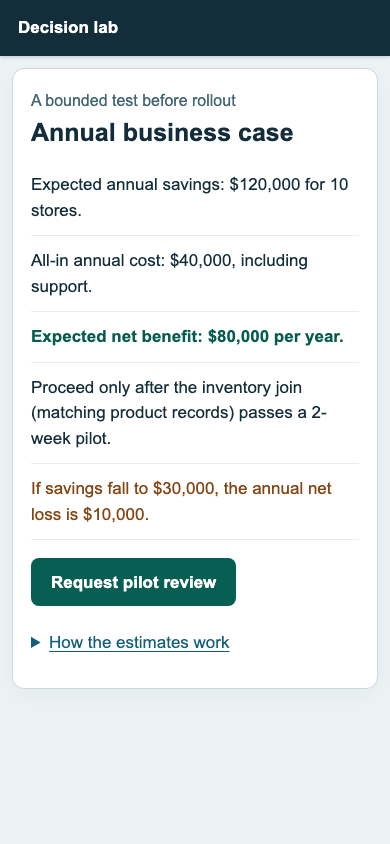

# Actual rendered fold collector

This optional package runs real Chromium against a public, invented business-case page and produces inspectable surface evidence. It imports only the public `quality-gate-sgd` package. The core runtime has no Playwright dependency and never automatically opens a browser.

From the repository root:

```sh
npm run build
npm --prefix examples/v2/rendered ci
cd examples/v2/rendered
npx playwright install chromium
npm test
npm run capture -- baseline improved
```

The local development dependency `file:../../..` resolves the core package root, through its public entry point. To reuse this example outside the checkout, replace that development dependency with your installed core release or packed core tarball, install Playwright explicitly, and keep the public imports unchanged. Node 20 or newer is required by this optional example.

`artifacts/<variant>/surface.json` contains frozen operator policy, response-body source manifest, source data, browser/font environment, full text geometry, every natural/boundary viewport membership, every required action trace, and screenshot byte digests. Actual response HTML and PNGs are adjacent. `evaluation.json` contains the independent facet verdicts and typed output evidence. `browser-test-summary.json` records the real test run. Generated artifacts and browser dependencies are ignored by Git.

## Reuse

The checked-in [observed run](evidence/observed.json) records the actual browser version, complete state coverage and all sixteen fixture verdicts. [Baseline measurements](evidence/baseline/surface.json) and [improved measurements](evidence/improved/surface.json) retain the full source/data/environment and membership inventories. This compact record includes every required state's entry PNG and the improved long narrow ending; the full per-membership PNG set is regenerated under `artifacts/`.

Run `node evidence.mjs` for a read-only source/data/environment/pixel and current-host replay. It does **not** rerun a browser. A changed evaluator identity requires explicit `node evidence.mjs --reevaluate`, which preserves the old evaluation and records that current-host reevaluation reused the verified browser report. A changed collector/settings identity requires a new actual browser run, followed by `node evidence.mjs --retain`. The replay refuses to silently accept either kind of stale identity.



## Reuse the collector

```js
import { chromium } from 'playwright';
import { collectSurface, collectorIdentity } from './collector.mjs';

const browser = await chromium.launch();
try {
  const collectorDigest = collectorIdentity(settings);
  // Create/freeze a reviewed policy whose collectorDigest matches these settings.
  const report = await collectSurface({
    browser, baseURL: 'http://127.0.0.1:8080', policy, settings, data,
    outputDir: './surface-evidence',
  });
} finally {
  await browser.close();
}
```

`settings` supplies independently reviewed chrome/data selectors, allowed nonsemantic labels (at most one visible occurrence of each), the disclosure selector/state, and explicit action-effect checks. `collectorIdentity` binds those settings, collector source, lockfile, and public sampling helpers. `SurfacePolicy.elements` provides stable semantic IDs/addresses, exact normalized text, concept memberships and definitions. DOM `data-qg-id` attributes locate those independent items; they do not author the policy.

The example restricts collection to explicit localhost origins with self-contained declared routes. Undeclared network resources are blocked and make collection unavailable. This is an auditable reference collector, not a crawler or arbitrary-site browser agent. For other applications, implement and pin the necessary asset, dynamic-layout and authentication behavior in a separate collector; do not infer an untested state from text or manufacture success when a capture fails.

## Public comparison

The same policy covers these six states:

| View | Input | Entry | Total cap | Novel cap |
|---|---|---|---:|---:|
| 1100 × 760, closed | Keyboard | `/decision` | 7 | 2 |
| 1100 × 760, open | Keyboard | `/decision` then disclosure | 9 | 2 |
| 390 × 844, closed | Touch emulation | `/decision` | 7 | 2 |
| 390 × 844, open | Touch emulation | `/decision` then disclosure | 9 | 2 |
| 1100 × 760, independently open | Keyboard | `/decision?disclosure=calculations` | 9 | 2 |
| 390 × 844, independently open | Touch emulation | `/decision?disclosure=calculations` | 9 | 2 |

The fixed geometry limits are 16px minimum semantic text, 44px minimum action dimensions, 150px maximum unaccounted vertical gap, 1.2 viewport heights for closed states and 2.2 for open states. All seven main items must be present in the entry viewport; all twelve items are required somewhere in every open state. Main items retain savings, all-in cost, net benefit, the defined pilot condition, unfavorable scenario, next action and usable disclosure. Supporting calculation/forecast/sensitivity detail is reachable without hiding those main commitments.

`fixture.mjs` exports `data`, `inventory`, `fixtureHtml(variant)`, and `fixturePolicy(collectorDigest)`. `run.mjs` exports the trusted `settings` and `captureFixture(variant, {browser, outputDir})`, returning `{policy, report, evaluation, summary}` for composition examples. The variants are:

- `baseline`, `improved`.
- `padding`, `boundary`, `candidate-caps`, `diagram`, `small-text`.
- `hidden-cost`, `removed-downside`, `filler`.
- `overlap`, `clipping`, `overflow`, `bad-focus`, `bad-keyboard`, `bad-touch`.

The browser suite tests actual captures for every variant, verifies current screenshot bytes, checks all supported integer scroll memberships, and verifies that missing states/windows/actions/captures and stale identities remain unavailable. Core `tests/v2/surfaces.test.ts` separately tests the boundary algebra, policy immutability, integrity, concept accounting and typed gate behavior with explicitly labeled synthetic mechanism fixtures.

Read [the surface contract](../../../docs/v2/SURFACES.md) for the precise integer-scroll/stationary-DOM restrictions, collector trust boundary and excluded claims. These caps are provisional design budgets for a business decision-maker unfamiliar with technical jargon. The examples do not measure human comprehension, prove causal improvement, establish a universal information bound, or certify overall accessibility.
